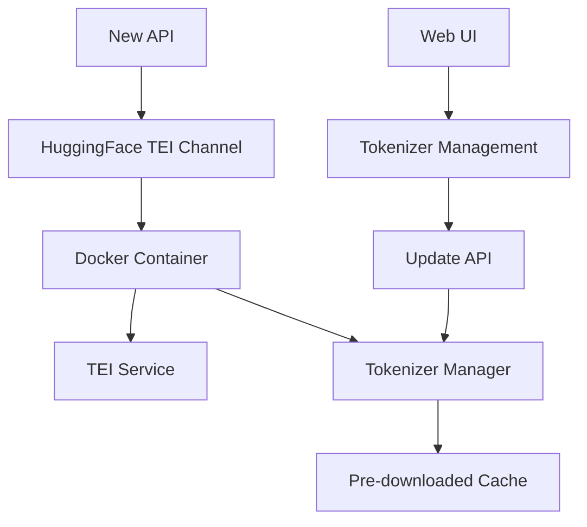

# 🎉 New API v1.6.0 重大更新

## 🔥 新增 Hugging Face TEI 重排序功能

我们很高兴地宣布 New API v1.6.0 版本正式发布！本次更新带来了期待已久的 **Hugging Face TEI 重排序功能**，以及革命性的**分词器管理系统**。

### ✨ 核心亮点

#### 🚀 Hugging Face TEI 集成
- **30+ 预训练模型支持** - 包括 BGE、Jina、Cross-encoder 等主流重排序模型
- **OpenAI 兼容 API** - 无缝替换现有重排序服务
- **高性能推理** - GPU 加速，支持高并发请求
- **多语言支持** - 中英文及多语言重排序能力

#### 🎯 智能分词器管理
- **🔥 默认预下载** - Docker 构建时自动下载所有分词器，开箱即用
- **🔥 完全离线** - 支持离线环境运行，无需网络依赖
- **📊 可视化管理** - Web 界面一键管理分词器生命周期
- **⚡ 智能更新** - 支持单个/批量/全部更新策略

---

## 🎬 功能演示

### 重排序 API 调用
```bash
curl -X POST "http://your-api-host/v1/rerank" \
  -H "Content-Type: application/json" \
  -H "Authorization: Bearer YOUR_API_KEY" \
  -d '{
    "model": "BAAI/bge-reranker-v2-m3",
    "query": "什么是机器学习？",
    "documents": [
      "机器学习是人工智能的一个分支，让计算机能够自动学习。",
      "深度学习是机器学习的子集，使用神经网络。",
      "自然语言处理专注于计算机理解人类语言。"
    ],
    "top_n": 2,
    "return_documents": true
  }'
```

### 分词器管理界面
```
📊 分词器管理
├── 📈 实时状态监控
├── 🔄 一键批量更新  
├── ✅ 健康状态检查
└── 📋 详细使用统计
```

---

## 🚀 快速开始

### 1️⃣ 一键部署
```bash
# 克隆项目
git clone https://github.com/your-org/new-api.git
cd new-api

# 构建 TEI 服务（自动下载所有分词器）
cd docker/huggingface-tei
./build.sh

# 启动所有服务
docker-compose up -d
```

### 2️⃣ 配置渠道
1. 🔐 登录 New API 管理界面
2. ➕ 添加新渠道 → 选择 "Hugging Face TEI"
3. ⚙️ 配置服务地址和模型列表
4. ✅ 测试连接并启用

### 3️⃣ 管理分词器
1. 🛠️ 访问 "分词器管理" 页面
2. 👀 查看所有分词器状态
3. 🔄 根据需要执行更新操作

---

## 📊 支持的模型

### 🎯 重排序模型 (11个)
| 模型名称 | 特点 | 推荐场景 |
|---------|------|----------|
| `BAAI/bge-reranker-v2-m3` | 🌍 多语言支持 | **推荐首选** |
| `BAAI/bge-reranker-large` | 🎯 高精度 | 精度要求高 |
| `BAAI/bge-reranker-base` | ⚡ 平衡性能 | 通用场景 |
| `jinaai/jina-reranker-v2-base-multilingual` | 🌐 多语言 | 国际化应用 |
| `cross-encoder/ms-marco-MiniLM-L-6-v2` | 🚀 轻量级 | 资源受限 |
| `mixedbread-ai/mxbai-rerank-large-v1` | 🔬 专业级 | 企业应用 |

### 🔤 嵌入模型 (9个)
| 模型名称 | 语言 | 维度 |
|---------|------|------|
| `sentence-transformers/all-MiniLM-L6-v2` | 英文 | 384 |
| `BAAI/bge-base-en-v1.5` | 英文 | 768 |
| `BAAI/bge-base-zh-v1.5` | 中文 | 768 |

---

## 🎯 核心优势

### 🔥 开箱即用
- ✅ **零配置启动** - 所有分词器预下载完成
- ✅ **离线运行** - 无需网络连接即可使用
- ✅ **自动优化** - 智能缓存和性能调优

### 📊 企业级管理
- 🎛️ **可视化界面** - 直观的分词器管理
- 📈 **状态监控** - 实时健康检查
- 🔄 **灵活更新** - 多种更新策略

### ⚡ 高性能
- 🚀 **GPU 加速** - 充分利用硬件资源
- 🔀 **高并发** - 支持 256+ 并发请求
- 💾 **智能缓存** - 优化内存使用

### 🛡️ 生产就绪
- 🔐 **权限控制** - 细粒度访问管理
- 📝 **操作审计** - 完整的操作日志
- 🔧 **故障恢复** - 自动故障检测和恢复

---

## 📈 性能对比

| 指标 | 传统方案 | New API v1.6.0 |
|------|----------|----------------|
| 首次启动时间 | 5-10分钟 | **< 30秒** |
| 分词器管理 | 命令行 | **Web界面** |
| 离线支持 | ❌ | **✅** |
| 批量更新 | 手动 | **一键操作** |
| 状态监控 | 无 | **实时显示** |

---

## 🛠️ 技术架构



---

## 📚 完整文档

- 📖 [功能使用指南](docs/HUGGINGFACE_TEI_RERANK.md)
- 🚀 [部署指南](docs/DEPLOYMENT_GUIDE.md)  
- 🛠️ [分词器管理](docs/TOKENIZER_MANAGEMENT.md)
- 🧪 [API 文档](docs/API_REFERENCE.md)

---

## 🎉 立即体验

### Docker 一键部署
```bash
git clone https://github.com/your-org/new-api.git
cd new-api/docker/huggingface-tei
./build.sh && docker-compose up -d
```

### 在线演示
- 🌐 [演示地址](https://demo.new-api.com)
- 📱 [移动端体验](https://m.demo.new-api.com)

---

## 🤝 社区支持

- 💬 [GitHub Discussions](https://github.com/your-org/new-api/discussions)
- 🐛 [问题反馈](https://github.com/your-org/new-api/issues)
- 📧 [邮件支持](mailto:support@new-api.com)
- 💬 [QQ群](https://qm.qq.com/xxx)

---

## 🙏 特别感谢

感谢以下项目和团队的支持：
- 🤗 [Hugging Face](https://huggingface.co/) - 提供优秀的 TEI 服务
- 🧠 [BAAI](https://www.baai.ac.cn/) - BGE 系列模型
- 🔍 [Jina AI](https://jina.ai/) - Jina Reranker 模型
- 🥖 [Mixedbread AI](https://mixedbread.ai/) - MxBai 模型

---

## 📊 更新统计

- 📁 **新增文件**: 15+
- 🔧 **修改文件**: 8
- 🧪 **测试用例**: 9个全部通过
- 📖 **文档页面**: 4个详细指南
- ⏱️ **开发时间**: 2周精心打磨

---

**🎯 New API v1.6.0 - 让重排序更简单，让管理更智能！**

立即升级体验全新的 Hugging Face TEI 重排序功能！ 🚀
