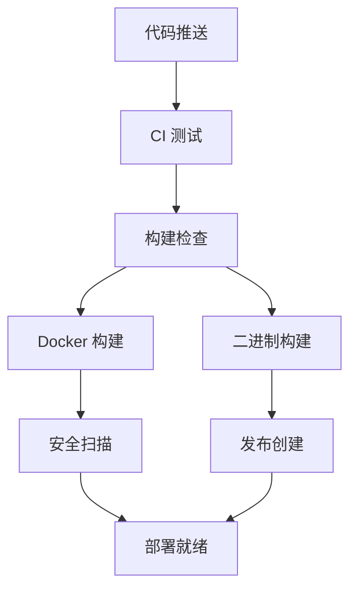

# 🚀 GitHub Actions 自动化构建指南

本文档详细介绍 New API 项目的 GitHub Actions 自动化构建配置，包括 Docker 镜像构建、可执行文件构建、CI/CD 流程等。

## 📋 工作流概览

### 🔄 自动化流程



### 📁 工作流文件

```
.github/workflows/
├── ci.yml              # CI 测试和代码质量检查
├── docker-build.yml    # Docker 镜像自动构建
├── build-release.yml   # 可执行文件构建和发布
├── auto-release.yml    # 自动发布管理
└── dependabot.yml      # 依赖更新管理
```

## 🧪 CI 工作流 (ci.yml)

### 触发条件
- 推送到 `main` 或 `rerank` 分支
- 创建 Pull Request 到 `main` 分支

### 主要功能
- **代码测试** - 运行单元测试和集成测试
- **代码质量** - golangci-lint 代码检查
- **安全扫描** - Gosec 安全漏洞扫描
- **前端构建** - React 前端构建验证
- **集成测试** - Docker 容器集成测试

### 测试环境
```yaml
services:
  mysql:8.0    # 数据库服务
  redis:7      # 缓存服务
  tei-test     # TEI 测试服务
```

## 🐳 Docker 构建工作流 (docker-build.yml)

### 构建目标

#### 1. 主应用镜像
```bash
ghcr.io/lim12137/new-api:latest
ghcr.io/lim12137/new-api:main
ghcr.io/lim12137/new-api:v1.6.0
```

#### 2. TEI 服务镜像
```bash
ghcr.io/lim12137/new-api-tei:latest
ghcr.io/lim12137/new-api-tei:main
ghcr.io/lim12137/new-api-tei:v1.6.0
```

#### 3. TEI 预加载镜像
```bash
ghcr.io/lim12137/new-api-tei-preload:latest
ghcr.io/lim12137/new-api-tei-preload:main
ghcr.io/lim12137/new-api-tei-preload:v1.6.0
```

### 多架构支持
- `linux/amd64` - x86_64 架构
- `linux/arm64` - ARM64 架构

### 安全特性
- **Trivy 扫描** - 容器漏洞扫描
- **SARIF 报告** - 安全扫描结果上传
- **签名验证** - 镜像签名和验证

## 📦 可执行文件构建工作流 (build-release.yml)

### 支持平台

| 平台 | 架构 | 文件名 |
|------|------|--------|
| Windows | amd64 | `new-api-windows-amd64.exe` |
| Windows | arm64 | `new-api-windows-arm64.exe` |
| Linux | amd64 | `new-api-linux-amd64` |
| Linux | arm64 | `new-api-linux-arm64` |
| Linux | 386 | `new-api-linux-386` |
| macOS | amd64 | `new-api-darwin-amd64` |
| macOS | arm64 | `new-api-darwin-arm64` |

### 构建特性
- **交叉编译** - 支持多平台交叉编译
- **静态链接** - CGO_ENABLED=0 静态编译
- **版本信息** - 嵌入版本、构建时间、Git 提交信息
- **压缩优化** - -ldflags "-s -w" 减小文件大小

### 发布包格式
- **Windows**: `.zip` 格式
- **Linux/macOS**: `.tar.gz` 格式
- **校验文件**: `checksums.txt` SHA256 校验

## 🏷️ 自动发布工作流 (auto-release.yml)

### 触发条件
- 推送标签 `v*` (如 `v1.6.0`, `v1.6.1-beta`)

### 发布内容
- **变更日志** - 自动生成版本间变更
- **下载链接** - 所有平台的二进制文件
- **Docker 信息** - 镜像拉取和使用命令
- **文档链接** - 相关文档和指南

### 发布类型
- **正式版本** - `v1.6.0`
- **预发布版本** - `v1.6.0-alpha`, `v1.6.0-beta`, `v1.6.0-rc1`

## ⚙️ 配置和使用

### 1. 环境变量配置

在 GitHub 仓库设置中配置以下 Secrets：

```bash
# 可选：HuggingFace 镜像端点
HF_ENDPOINT=https://hf-mirror.com

# 自动配置的 Secrets (无需手动设置)
GITHUB_TOKEN=<自动生成>
```

### 2. 权限配置

确保 GitHub Actions 具有以下权限：
- `contents: read` - 读取代码
- `packages: write` - 推送 Docker 镜像
- `security-events: write` - 上传安全扫描结果

### 3. 分支保护规则

建议为 `main` 分支设置保护规则：
```yaml
required_status_checks:
  - "test"
  - "lint" 
  - "security"
  - "build-check"
```

## 🔧 本地测试

### 测试 CI 工作流
```bash
# 安装 act (GitHub Actions 本地运行工具)
curl https://raw.githubusercontent.com/nektos/act/master/install.sh | sudo bash

# 运行 CI 测试
act -j test

# 运行构建检查
act -j build-check
```

### 测试 Docker 构建
```bash
# 构建主应用镜像
docker build -t new-api:test .

# 构建 TEI 镜像
cd docker/huggingface-tei
docker build -t new-api-tei:test .
```

### 测试可执行文件构建
```bash
# Linux 构建
GOOS=linux GOARCH=amd64 go build -tags=nomsgpack -ldflags "-s -w" -o new-api-linux-amd64 .

# Windows 构建
GOOS=windows GOARCH=amd64 go build -tags=nomsgpack -ldflags "-s -w" -o new-api-windows-amd64.exe .

# macOS 构建
GOOS=darwin GOARCH=amd64 go build -tags=nomsgpack -ldflags "-s -w" -o new-api-darwin-amd64 .
```

## 📊 监控和维护

### 1. 构建状态监控

在 README 中添加状态徽章：
```markdown


```

### 2. 依赖更新

Dependabot 自动管理依赖更新：
- **Go 模块** - 每周一检查
- **前端依赖** - 每周一检查  
- **GitHub Actions** - 每周一检查
- **Docker 基础镜像** - 每周一检查

### 3. 安全扫描

定期安全扫描：
- **代码扫描** - Gosec 静态分析
- **容器扫描** - Trivy 漏洞扫描
- **依赖扫描** - Dependabot 安全更新

## 🚀 发布流程

### 1. 开发版本发布
```bash
# 推送到 rerank 分支触发构建
git push origin rerank
```

### 2. 正式版本发布
```bash
# 创建并推送标签
git tag v1.6.0
git push origin v1.6.0

# 自动触发：
# 1. Docker 镜像构建
# 2. 可执行文件构建
# 3. GitHub Release 创建
# 4. 文档和变更日志生成
```

### 3. 预发布版本
```bash
# 创建预发布标签
git tag v1.6.0-beta.1
git push origin v1.6.0-beta.1

# 将创建预发布版本
```

## 🔍 故障排除

### 常见问题

#### 1. Docker 构建失败
```bash
# 检查 Dockerfile 语法
docker build --no-cache -t test .

# 检查构建日志
# 在 GitHub Actions 页面查看详细日志
```

#### 2. 测试失败
```bash
# 本地运行测试
go test -v ./...

# 检查测试环境
docker-compose -f docker-compose.test.yml up
```

#### 3. 发布失败
```bash
# 检查标签格式
git tag --list | grep v1.6

# 检查权限设置
# 确保 GITHUB_TOKEN 有足够权限
```

### 调试技巧

1. **启用调试模式**
   ```yaml
   - name: Debug
     run: echo "::debug::Debug message"
   ```

2. **查看环境变量**
   ```yaml
   - name: Show env
     run: env | sort
   ```

3. **保存构建产物**
   ```yaml
   - name: Upload artifacts
     uses: actions/upload-artifact@v3
     with:
       name: debug-files
       path: |
         *.log
         build/
   ```

## 📚 相关资源

- [GitHub Actions 文档](https://docs.github.com/en/actions)
- [Docker Buildx 文档](https://docs.docker.com/buildx/)
- [Go 交叉编译指南](https://golang.org/doc/install/source#environment)
- [Dependabot 配置](https://docs.github.com/en/code-security/dependabot)

---

**🎉 通过 GitHub Actions，New API 实现了完全自动化的 CI/CD 流程！**
