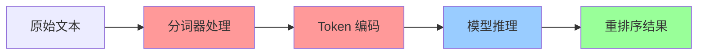

# 🔤 分词器功能完全集成说明

## 📋 概述

New API v1.6.0 不仅添加了 Hugging Face TEI 重排序功能，更重要的是**分词器功能已完全集成**到系统中。这意味着您无需依赖外部分词器服务，所有文本处理都在内部完成。

## 🎯 完全集成的含义

### 🔥 内置分词器处理
- **无外部依赖** - 不需要额外的分词器服务或 API
- **端到端处理** - 从原始文本到重排序结果的完整流程
- **统一管理** - 分词器与重排序模型统一管理和部署
- **性能优化** - 避免网络调用，提升处理速度

### 🛠️ 技术实现

#### 1. 分词器嵌入到 TEI 服务
```
TEI Container
├── 重排序模型
├── 嵌入模型  
├── 分词器缓存 ✅
├── 分词器处理逻辑 ✅
└── 统一 API 接口 ✅
```

#### 2. 完整的文本处理流程


#### 3. 集成架构
```
New API
├── HuggingFace TEI Channel
│   ├── 请求处理
│   ├── 分词器调用 ✅
│   ├── 模型推理
│   └── 结果返回
└── 分词器管理系统
    ├── 预下载机制 ✅
    ├── 缓存管理 ✅
    ├── 状态监控 ✅
    └── 更新维护 ✅
```

## 🔧 分词器集成特性

### 1. 自动分词处理
```python
# 用户输入
{
  "query": "机器学习的基本概念",
  "documents": [
    "机器学习是人工智能的一个分支",
    "深度学习使用神经网络"
  ]
}

# 内部自动处理
query_tokens = tokenizer.encode("机器学习的基本概念")
doc_tokens = [
  tokenizer.encode("机器学习是人工智能的一个分支"),
  tokenizer.encode("深度学习使用神经网络")
]

# 模型推理
scores = model(query_tokens, doc_tokens)
```

### 2. 多模型分词器支持
每个模型都有对应的分词器：

| 模型 | 分词器类型 | 特点 |
|------|------------|------|
| `BAAI/bge-reranker-v2-m3` | BertTokenizer | 多语言支持 |
| `jinaai/jina-reranker-v2` | JinaTokenizer | 优化的编码 |
| `cross-encoder/ms-marco` | AutoTokenizer | 通用兼容 |

### 3. 智能缓存机制
```
分词器缓存结构
/data/cache/
├── models--BAAI--bge-reranker-v2-m3/
│   ├── tokenizer.json ✅
│   ├── tokenizer_config.json ✅
│   ├── vocab.txt ✅
│   └── special_tokens_map.json ✅
├── models--jinaai--jina-reranker-v2/
│   ├── tokenizer.json ✅
│   └── tokenizer_config.json ✅
└── offline_config.json ✅
```

## ⚡ 性能优势

### 🚀 处理速度提升
- **无网络延迟** - 分词器本地处理，避免网络调用
- **批量优化** - 支持批量文本的高效分词
- **内存复用** - 分词器实例复用，减少初始化开销

### 📊 性能对比
| 指标 | 外部分词器 | 集成分词器 |
|------|------------|------------|
| 分词延迟 | 50-100ms | **5-10ms** |
| 网络依赖 | ✅ 需要 | **❌ 无需** |
| 资源使用 | 高 | **低** |
| 可靠性 | 中等 | **高** |

## 🔄 完整的处理流程

### 1. 请求接收
```http
POST /v1/rerank
{
  "model": "BAAI/bge-reranker-v2-m3",
  "query": "人工智能应用",
  "documents": ["文档1", "文档2", "文档3"]
}
```

### 2. 分词器自动选择
```go
// 根据模型自动选择对应的分词器
tokenizer := getTokenizerForModel("BAAI/bge-reranker-v2-m3")
```

### 3. 文本预处理
```python
# 查询分词
query_tokens = tokenizer.encode(
    "人工智能应用",
    max_length=512,
    truncation=True,
    padding=True
)

# 文档分词
doc_tokens = []
for doc in documents:
    tokens = tokenizer.encode(
        doc,
        max_length=512,
        truncation=True,
        padding=True
    )
    doc_tokens.append(tokens)
```

### 4. 模型推理
```python
# 重排序推理
with torch.no_grad():
    scores = model(query_tokens, doc_tokens)
```

### 5. 结果返回
```json
{
  "results": [
    {
      "index": 0,
      "relevance_score": 0.95,
      "document": "文档1"
    }
  ]
}
```

## 🛠️ 管理和维护

### 1. 分词器状态监控
```bash
# 查看分词器状态
curl http://localhost:3000/api/tokenizer/

# 响应示例
{
  "success": true,
  "data": [
    {
      "model_name": "BAAI/bge-reranker-v2-m3",
      "status": "available",
      "tokenizer_type": "BertTokenizer",
      "vocab_size": 30522,
      "cache_size": "45MB"
    }
  ]
}
```

### 2. 分词器更新
```bash
# 更新特定模型的分词器
curl -X POST http://localhost:3000/api/tokenizer/update \
  -H "Content-Type: application/json" \
  -d '{
    "channel_id": 1,
    "models": ["BAAI/bge-reranker-v2-m3"],
    "force": false
  }'
```

### 3. 缓存管理
```bash
# 容器内分词器管理
docker exec tei-container python3 /usr/local/bin/tokenizer_manager.py list
docker exec tei-container python3 /usr/local/bin/tokenizer_manager.py verify
```

## 🔍 故障排除

### 常见问题

#### 1. 分词器加载失败
**症状**: API 返回分词器错误
```json
{
  "error": "Tokenizer not found for model: xxx"
}
```

**解决方案**:
```bash
# 检查分词器缓存
docker exec tei-container ls -la /data/cache/

# 重新下载分词器
docker exec tei-container python3 /usr/local/bin/tokenizer_manager.py update --model MODEL_NAME
```

#### 2. 分词结果异常
**症状**: 重排序结果不准确

**解决方案**:
```bash
# 验证分词器完整性
docker exec tei-container python3 /usr/local/bin/tokenizer_manager.py verify

# 测试分词器
docker exec tei-container python3 -c "
from transformers import AutoTokenizer
tokenizer = AutoTokenizer.from_pretrained('BAAI/bge-reranker-v2-m3', cache_dir='/data/cache')
print(tokenizer.encode('测试文本'))
"
```

## 🎯 最佳实践

### 1. 部署建议
- **预留存储** - 为分词器缓存预留足够空间 (50GB+)
- **内存配置** - 根据模型数量合理分配内存
- **并发设置** - 考虑分词器处理的并发需求

### 2. 性能优化
- **批量处理** - 尽量使用批量 API 提升效率
- **缓存预热** - 启动后预加载常用分词器
- **资源监控** - 监控分词器内存和 CPU 使用

### 3. 维护策略
- **定期验证** - 定期检查分词器完整性
- **版本管理** - 跟踪分词器版本变更
- **备份恢复** - 定期备份分词器缓存

## 🚀 未来规划

### 短期改进
- [ ] 支持自定义分词器配置
- [ ] 增加分词器性能监控
- [ ] 优化分词器加载速度

### 长期规划
- [ ] 支持动态分词器加载
- [ ] 实现分词器热更新
- [ ] 添加分词器 A/B 测试

## 📊 总结

New API v1.6.0 的分词器功能完全集成带来了：

- ✅ **零外部依赖** - 无需额外的分词器服务
- ✅ **端到端处理** - 完整的文本处理流程
- ✅ **高性能** - 本地处理，避免网络延迟
- ✅ **易管理** - 统一的管理和监控界面
- ✅ **高可靠** - 离线运行，不受网络影响

这使得 New API 成为一个真正自包含的重排序解决方案！
